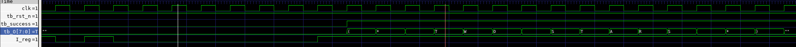
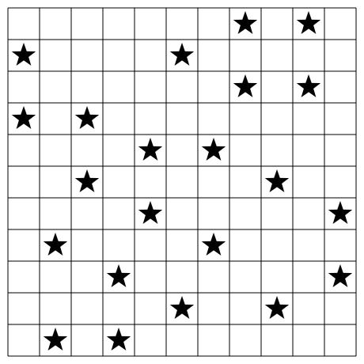
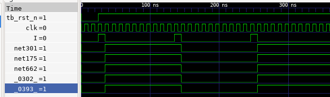
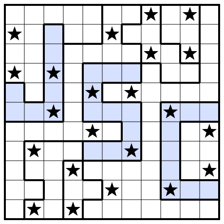

# Gandalf

## tl;dr

<p align="center">
  
</p>

## The Mines of Moria

All the secrets lay in the [GDS puzzle file](inputs/puzzle.gds). There's two halves to the
puzzle: first find out what sequence of the input `I` causes `success` to be set and secondly what
that causes `O[8]` to emit. Given that it is a 8-bit output, I am expecting a series of characters.
The [example input](inputs/example_inputs.vcd) contain 121 bit long input sequences. This may be of
help later, but first to reverse-engineer the circuit. Lets enter the Mines!

### The Red Book of Westmarch *aka GDS file*

At it's core, a GDS file is a long sequence of records. Each record is of the following format:

<p align="center">
    
</p>

[Parse.hs](src/Parse.hs) contains the records and parsing code for performing this. I use attoparsec
for as my parser combinator library. The records only tell one-half of the story though. In reality,
it is a flattened representation of the actual structure. If we look at the record types, we get an
idea of the actual nesting structure:

<p align="left">
    
</p>

So as it turns out, EndEl is an end statement, which ends several other elements. This helps us to
build a sort of AST, to capture the forest of trees structure of a GDS file. This is coded in
[AST.hs](src/AST.hs). It uses a simple stack based method to create a level of nesting when a 
*begin element* is found and pops off the level when an *end element* is found. The following fragment
identifies these:

```haskell
isOpener :: GdsRecordT -> Bool
isOpener r = case r of
  GdsBgnLibT{} -> True
  GdsBgnStrT{} -> True
  GdsBoundaryT -> True
  GdsPathT     -> True
  GdsSrefT     -> True
  GdsArefT     -> True
  GdsTextT     -> True
  _            -> False

isCloser :: GdsRecordT -> Bool
isCloser r = case r of
  GdsEndLibT -> True
  GdsEndStrT -> True
  GdsEndElT  -> True
  _          -> False

```

In keeping with common terminology, a `BgnStr` and `EndStr` defines a **Cell**. Thus, a GDS file can
be considered to be a set of cells, among which there is a *top cell*. The record definition of a Cell
is as follows, defined in [Structure.hs](src/Structure.hs):

```haskell
data Cell = Cell
  { name     :: String
  , boundary :: [Boundary]
  , path     :: [Path]
  , text     :: [TextDescription]
  , cellRef  :: [CellRef]
  } deriving (Show)
```

A cell contain's **paths** and **boundaries**. Both are effectively traces in some layer of the IC.
The only distinction is in the
fact that a boundary defines an ortholinear polygon. A path is a straight connection, with end caps
that can either stick out, or be round or be flat. The file that we are given has no round ends tho,
so this makes life a bit easier later.

The text's act as labels, and are handily in the same layer as the thing they are describing. Layer's
in GDS have an `index` and a `kind`. The `index` indentifies the actual layer, while the `kind` is
used to differentiate between different elements in a layer. For instance, the boundary and text
are present in different `kind`'s.

The true "nesting" nature of the GDS file lies in the `cellRef` element. As the name suggests, it is
a reference to a cell that is already declared.
```haskell
data CellRef = CellRef
  { name        :: String
  , coord       :: Coordinate
  , translation :: Maybe GdsStransFlags
  , angle       :: Maybe Double
  } deriving (Show)
```
The reference is by name. A `CellRef` thus can be considered as an instantiation of a cell. The
instantiation (as performed by the PNR tool) positions it at some coordinate, at some angle (this is usually 0 or 90),
and with a "translation" (this is to perform something like mirroring).

We can dump the structure of the GDS file using the `dump` command defined in [Main.hs](exe/Main.hs).
For non-top cells, we get definitions such as follows:

<details>
<summary>Click to expand</summary>

```
└── Cell "sky130_fd_sc_hd__nand2_2"
    ├── Boundary
    │   ├── layer: Layer {index = 67, kind = 20}
    │   └── coords: [(0, -85), (0, 85), (595, 85), (595, 545), (765, 545), (765, 85), (2300, 85), (2300, -85), (0, -85)]
    ├── Boundary
    │   ├── layer: Layer {index = 67, kind = 20}
    │   └── coords: [(85, 1495), (85, 2635), (0, 2635), (0, 2805), (2300, 2805), (2300, 2635), (2110, 2635), (2110, 1835), (1855, 1835), (1855, 2635), (1185, 2635), (1185, 1835), (1015, 1835), (1015, 2635), (345, 2635), (345, 1495), (85, 1495)]
    ├── Boundary
    │   ├── layer: Layer {index = 67, kind = 20}
    │   └── coords: [(85, 255), (85, 885), (1185, 885), (1185, 465), (1775, 465), (1775, 485), (2105, 485), (2105, 255), (935, 255), (935, 715), (425, 715), (425, 255), (85, 255)]
    ├── Boundary
    │   ├── layer: Layer {index = 67, kind = 20}
    │   └── coords: [(1355, 655), (1355, 905), (1935, 905), (1935, 1495), (515, 1495), (515, 2465), (845, 2465), (845, 1665), (1355, 1665), (1355, 2465), (1685, 2465), (1685, 1665), (2215, 1665), (2215, 655), (1355, 655)]
    ├── Boundary
    │   ├── layer: Layer {index = 67, kind = 20}
    │   └── coords: [(85, 1075), (85, 1325), (845, 1325), (845, 1075), (85, 1075)]
    ├── Boundary
    │   ├── layer: Layer {index = 67, kind = 20}
    │   └── coords: [(1015, 1075), (1015, 1325), (1765, 1325), (1765, 1075), (1015, 1075)]
    ├── Boundary
    │   ├── layer: Layer {index = 67, kind = 44}
    │   └── coords: [(145, 2635), (145, 2805), (315, 2805), (315, 2635), (145, 2635)]
    ├── Boundary
    │   ├── layer: Layer {index = 67, kind = 44}
    │   └── coords: [(145, -85), (145, 85), (315, 85), (315, -85), (145, -85)]
    ├── Boundary
    │   ├── layer: Layer {index = 67, kind = 44}
    │   └── coords: [(605, 2635), (605, 2805), (775, 2805), (775, 2635), (605, 2635)]
    ├── Boundary
    │   ├── layer: Layer {index = 67, kind = 44}
    │   └── coords: [(605, -85), (605, 85), (775, 85), (775, -85), (605, -85)]
    ├── Boundary
    │   ├── layer: Layer {index = 67, kind = 44}
    │   └── coords: [(1065, 2635), (1065, 2805), (1235, 2805), (1235, 2635), (1065, 2635)]
    ├── Boundary
    │   ├── layer: Layer {index = 67, kind = 44}
    │   └── coords: [(1065, -85), (1065, 85), (1235, 85), (1235, -85), (1065, -85)]
    ├── Boundary
    │   ├── layer: Layer {index = 67, kind = 44}
    │   └── coords: [(1525, 2635), (1525, 2805), (1695, 2805), (1695, 2635), (1525, 2635)]
    ├── Boundary
    │   ├── layer: Layer {index = 67, kind = 44}
    │   └── coords: [(1525, -85), (1525, 85), (1695, 85), (1695, -85), (1525, -85)]
    ├── Boundary
    │   ├── layer: Layer {index = 67, kind = 44}
    │   └── coords: [(1985, 2635), (1985, 2805), (2155, 2805), (2155, 2635), (1985, 2635)]
    ├── Boundary
    │   ├── layer: Layer {index = 67, kind = 44}
    │   └── coords: [(1985, -85), (1985, 85), (2155, 85), (2155, -85), (1985, -85)]
    ├── Boundary
    │   ├── layer: Layer {index = 67, kind = 16}
    │   └── coords: [(1990, 765), (1990, 935), (2160, 935), (2160, 765), (1990, 765)]
    ├── Boundary
    │   ├── layer: Layer {index = 67, kind = 16}
    │   └── coords: [(1990, 1105), (1990, 1275), (2160, 1275), (2160, 1105), (1990, 1105)]
    ├── Boundary
    │   ├── layer: Layer {index = 67, kind = 16}
    │   └── coords: [(1990, 1445), (1990, 1615), (2160, 1615), (2160, 1445), (1990, 1445)]
    ├── Boundary
    │   ├── layer: Layer {index = 67, kind = 16}
    │   └── coords: [(1530, 1105), (1530, 1275), (1700, 1275), (1700, 1105), (1530, 1105)]
    ├── Boundary
    │   ├── layer: Layer {index = 67, kind = 16}
    │   └── coords: [(1070, 1105), (1070, 1275), (1240, 1275), (1240, 1105), (1070, 1105)]
    ├── Boundary
    │   ├── layer: Layer {index = 67, kind = 16}
    │   └── coords: [(610, 1105), (610, 1275), (780, 1275), (780, 1105), (610, 1105)]
    ├── Boundary
    │   ├── layer: Layer {index = 67, kind = 16}
    │   └── coords: [(150, 1105), (150, 1275), (320, 1275), (320, 1105), (150, 1105)]
    ├── Boundary
    │   ├── layer: Layer {index = 68, kind = 16}
    │   └── coords: [(150, -85), (150, 85), (320, 85), (320, -85), (150, -85)]
    ├── Boundary
    │   ├── layer: Layer {index = 68, kind = 16}
    │   └── coords: [(150, 2635), (150, 2805), (320, 2805), (320, 2635), (150, 2635)]
    ├── Boundary
    │   ├── layer: Layer {index = 64, kind = 16}
    │   └── coords: [(150, 2635), (150, 2805), (320, 2805), (320, 2635), (150, 2635)]
    ├── Boundary
    │   ├── layer: Layer {index = 122, kind = 16}
    │   └── coords: [(150, -85), (150, 85), (320, 85), (320, -85), (150, -85)]
    ├── Boundary
    │   ├── layer: Layer {index = 236, kind = 0}
    │   └── coords: [(0, 0), (0, 2720), (2300, 2720), (2300, 0), (0, 0)]
    ├── Boundary
    │   ├── layer: Layer {index = 66, kind = 20}
    │   └── coords: [(1235, 105), (1235, 2615), (1385, 2615), (1385, 1325), (1655, 1325), (1655, 2615), (1805, 2615), (1805, 105), (1655, 105), (1655, 995), (1385, 995), (1385, 105), (1235, 105)]
    ├── Boundary
    │   ├── layer: Layer {index = 66, kind = 20}
    │   └── coords: [(395, 105), (395, 2615), (545, 2615), (545, 1325), (815, 1325), (815, 2615), (965, 2615), (965, 105), (815, 105), (815, 995), (545, 995), (545, 105), (395, 105)]
    ├── Boundary
    │   ├── layer: Layer {index = 81, kind = 4}
    │   └── coords: [(0, 0), (0, 2720), (2300, 2720), (2300, 0), (0, 0)]
    ├── Boundary
    │   ├── layer: Layer {index = 94, kind = 20}
    │   └── coords: [(0, 1355), (0, 2910), (2300, 2910), (2300, 1355), (0, 1355)]
    ├── Boundary
    │   ├── layer: Layer {index = 93, kind = 44}
    │   └── coords: [(0, -190), (0, 1015), (2300, 1015), (2300, -190), (0, -190)]
    ├── Boundary
    │   ├── layer: Layer {index = 65, kind = 20}
    │   └── coords: [(135, 1485), (135, 2485), (2065, 2485), (2065, 1485), (135, 1485)]
    ├── Boundary
    │   ├── layer: Layer {index = 65, kind = 20}
    │   └── coords: [(135, 235), (135, 885), (2065, 885), (2065, 235), (135, 235)]
    ├── Boundary
    │   ├── layer: Layer {index = 64, kind = 20}
    │   └── coords: [(-190, 1305), (-190, 2910), (2490, 2910), (2490, 1305), (-190, 1305)]
    ├── Boundary
    │   ├── layer: Layer {index = 78, kind = 44}
    │   └── coords: [(0, 1250), (0, 2720), (2300, 2720), (2300, 1250), (0, 1250)]
    ├── Boundary
    │   ├── layer: Layer {index = 95, kind = 20}
    │   └── coords: [(0, 975), (0, 1345), (2300, 1345), (2300, 975), (0, 975)]
    ├── Boundary
    │   ├── layer: Layer {index = 66, kind = 44}
    │   └── coords: [(175, 2255), (175, 2425), (345, 2425), (345, 2255), (175, 2255)]
    ├── Boundary
    │   ├── layer: Layer {index = 66, kind = 44}
    │   └── coords: [(175, 1915), (175, 2085), (345, 2085), (345, 1915), (175, 1915)]
    ├── Boundary
    │   ├── layer: Layer {index = 66, kind = 44}
    │   └── coords: [(175, 1575), (175, 1745), (345, 1745), (345, 1575), (175, 1575)]
    ├── Boundary
    │   ├── layer: Layer {index = 66, kind = 44}
    │   └── coords: [(175, 635), (175, 805), (345, 805), (345, 635), (175, 635)]
    ├── Boundary
    │   ├── layer: Layer {index = 66, kind = 44}
    │   └── coords: [(175, 295), (175, 465), (345, 465), (345, 295), (175, 295)]
    ├── Boundary
    │   ├── layer: Layer {index = 66, kind = 44}
    │   └── coords: [(1855, 295), (1855, 465), (2025, 465), (2025, 295), (1855, 295)]
    ├── Boundary
    │   ├── layer: Layer {index = 66, kind = 44}
    │   └── coords: [(595, 2255), (595, 2425), (765, 2425), (765, 2255), (595, 2255)]
    ├── Boundary
    │   ├── layer: Layer {index = 66, kind = 44}
    │   └── coords: [(595, 1915), (595, 2085), (765, 2085), (765, 1915), (595, 1915)]
    ├── Boundary
    │   ├── layer: Layer {index = 66, kind = 44}
    │   └── coords: [(595, 1575), (595, 1745), (765, 1745), (765, 1575), (595, 1575)]
    ├── Boundary
    │   ├── layer: Layer {index = 66, kind = 44}
    │   └── coords: [(595, 1075), (595, 1245), (765, 1245), (765, 1075), (595, 1075)]
    ├── Boundary
    │   ├── layer: Layer {index = 66, kind = 44}
    │   └── coords: [(595, 295), (595, 465), (765, 465), (765, 295), (595, 295)]
    ├── Boundary
    │   ├── layer: Layer {index = 66, kind = 44}
    │   └── coords: [(1015, 2255), (1015, 2425), (1185, 2425), (1185, 2255), (1015, 2255)]
    ├── Boundary
    │   ├── layer: Layer {index = 66, kind = 44}
    │   └── coords: [(1015, 1915), (1015, 2085), (1185, 2085), (1185, 1915), (1015, 1915)]
    ├── Boundary
    │   ├── layer: Layer {index = 66, kind = 44}
    │   └── coords: [(1015, 635), (1015, 805), (1185, 805), (1185, 635), (1015, 635)]
    ├── Boundary
    │   ├── layer: Layer {index = 66, kind = 44}
    │   └── coords: [(1015, 295), (1015, 465), (1185, 465), (1185, 295), (1015, 295)]
    ├── Boundary
    │   ├── layer: Layer {index = 66, kind = 44}
    │   └── coords: [(1435, 2255), (1435, 2425), (1605, 2425), (1605, 2255), (1435, 2255)]
    ├── Boundary
    │   ├── layer: Layer {index = 66, kind = 44}
    │   └── coords: [(1435, 1915), (1435, 2085), (1605, 2085), (1605, 1915), (1435, 1915)]
    ├── Boundary
    │   ├── layer: Layer {index = 66, kind = 44}
    │   └── coords: [(1435, 1575), (1435, 1745), (1605, 1745), (1605, 1575), (1435, 1575)]
    ├── Boundary
    │   ├── layer: Layer {index = 66, kind = 44}
    │   └── coords: [(1435, 1075), (1435, 1245), (1605, 1245), (1605, 1075), (1435, 1075)]
    ├── Boundary
    │   ├── layer: Layer {index = 66, kind = 44}
    │   └── coords: [(1435, 655), (1435, 825), (1605, 825), (1605, 655), (1435, 655)]
    ├── Boundary
    │   ├── layer: Layer {index = 66, kind = 44}
    │   └── coords: [(1855, 2255), (1855, 2425), (2025, 2425), (2025, 2255), (1855, 2255)]
    ├── Boundary
    │   ├── layer: Layer {index = 66, kind = 44}
    │   └── coords: [(1855, 1915), (1855, 2085), (2025, 2085), (2025, 1915), (1855, 1915)]
    ├── Path
    │   ├── layer: Layer {index = 68, kind = 20}
    │   ├── width: 480
    │   ├── start: (0, 2720)
    │   ├── end: (2300, 2720)
    │   └── kind: Flush
    ├── Path
    │   ├── layer: Layer {index = 68, kind = 20}
    │   ├── width: 480
    │   ├── start: (0, 0)
    │   ├── end: (2300, 0)
    │   └── kind: Flush
    ├── Text
    │   ├── layer: Layer {index = 67, kind = 5}
    │   ├── coord: (2075, 850)
    │   ├── value: "Y"
    │   ├── translation: {mirrorX=False, absMag=False, absAngle=False}
    │   ├── presentation: {font=0, vertJust=1, horizJust=1}
    │   └── magnification: 0.125
    ├── Text
    │   ├── layer: Layer {index = 67, kind = 5}
    │   ├── coord: (2075, 1190)
    │   ├── value: "Y"
    │   ├── translation: {mirrorX=False, absMag=False, absAngle=False}
    │   ├── presentation: {font=0, vertJust=1, horizJust=1}
    │   └── magnification: 0.125
    ├── Text
    │   ├── layer: Layer {index = 67, kind = 5}
    │   ├── coord: (2075, 1530)
    │   ├── value: "Y"
    │   ├── translation: {mirrorX=False, absMag=False, absAngle=False}
    │   ├── presentation: {font=0, vertJust=1, horizJust=1}
    │   └── magnification: 0.125
    ├── Text
    │   ├── layer: Layer {index = 67, kind = 5}
    │   ├── coord: (1615, 1190)
    │   ├── value: "A"
    │   ├── translation: {mirrorX=False, absMag=False, absAngle=False}
    │   ├── presentation: {font=0, vertJust=1, horizJust=1}
    │   └── magnification: 0.125
    ├── Text
    │   ├── layer: Layer {index = 67, kind = 5}
    │   ├── coord: (695, 1190)
    │   ├── value: "B"
    │   ├── translation: {mirrorX=False, absMag=False, absAngle=False}
    │   ├── presentation: {font=0, vertJust=1, horizJust=1}
    │   └── magnification: 0.125
    ├── Text
    │   ├── layer: Layer {index = 68, kind = 5}
    │   ├── coord: (230, 0)
    │   ├── value: "VGND"
    │   ├── translation: {mirrorX=False, absMag=False, absAngle=False}
    │   ├── presentation: {font=0, vertJust=1, horizJust=1}
    │   └── magnification: 0.1
    ├── Text
    │   ├── layer: Layer {index = 68, kind = 5}
    │   ├── coord: (230, 2720)
    │   ├── value: "VPWR"
    │   ├── translation: {mirrorX=False, absMag=False, absAngle=False}
    │   ├── presentation: {font=0, vertJust=1, horizJust=1}
    │   └── magnification: 0.1
    ├── Text
    │   ├── layer: Layer {index = 64, kind = 5}
    │   ├── coord: (230, 2720)
    │   ├── value: "VPB"
    │   ├── translation: {mirrorX=False, absMag=False, absAngle=False}
    │   ├── presentation: {font=0, vertJust=1, horizJust=1}
    │   └── magnification: 0.1
    ├── Text
    │   ├── layer: Layer {index = 64, kind = 59}
    │   ├── coord: (230, 0)
    │   ├── value: "VNB"
    │   ├── translation: {mirrorX=False, absMag=False, absAngle=False}
    │   ├── presentation: {font=0, vertJust=1, horizJust=1}
    │   └── magnification: 0.1
    └── Text
        ├── layer: Layer {index = 83, kind = 44}
        ├── coord: (0, 0)
        ├── value: "nand2_2"
        ├── translation: {mirrorX=False, absMag=False, absAngle=False}
        ├── angle: 90.0
        └── magnification: 0.1

```

</details>

The rather wordy definition can be represented by a neat diagram in a GDS file viewer called
KLayout:

<p align="center">
    
</p>

Okay fine, I lied. There's nothing neat about this diagram and is probably less understandable
than the text version. What's all those ugly colours and why's there so many rectangles?

### There's Layers to this

Remember, when I said that all the elements in a Cell have a "layer"? That's all the colours.
Turns out that, even though in a GDS file you can have sensibly named cells such as `sky130_fd_sc_hd__nand2_2`
(so a NAND gate with 2 inputs), these cells look nothing like the diagrams we draw in netlists. An
IC has multiple layers. The lowest layer will be the die itself. Within it, photolithographic techniques
(yes ASML) are used to create "diffusion" areas to make transistors (some variant of FET's for most parts).
Yet more layers are deposited over them to create metal layers to create connections. Other materials
can be deposited to make things like capacitors and resistors.

Crucially, there isn't just one metallic layer and various layers need to be interconnected. A layer
can be considered a horizontal plane in a vertically stacked die. Inter-layer connections are created
using **VIA**'s. These are effectively little cuts made in the two layers being connected and an
electrical connection created in the cut part. Those are all the little squares you see in the NAND
diagram above. Opening the GDS file in TinyTapeout's GDS viewer lets us see the GDS file in 3D. The
little black columns in the image below shows the VIA's.

<p align="center">
    
</p>

There's one information gap we need to solve before we can proceeed. What layers are metallic and
what layer's aren't. Also, which layers have the VIA's and which pair of layers do they connect.
Such information is found in LYP files (layer property files), which are provided by the creator of
the cells being used by the PNR tool.

So who created these cells? The hint is in the name of the cells themselves:

```
├── Cell "sky130_fd_sc_hd__decap_3"
├── Cell "sky130_fd_sc_hd__tapvpwrvgnd_1"
├── Cell "sky130_fd_sc_hd__nand2_2"
├── Cell "sky130_fd_sc_hd__and2_2"
├── Cell "sky130_fd_sc_hd__xor2_2"
├── Cell "sky130_fd_sc_hd__xnor2_2"
├── Cell "sky130_fd_sc_hd__a31o_2"
├── Cell "sky130_fd_sc_hd__or2_2"
├── Cell "sky130_fd_sc_hd__nor2_2"
├── Cell "sky130_fd_sc_hd__a21bo_2"
├── Cell "sky130_fd_sc_hd__a21o_2"
├── Cell "sky130_fd_sc_hd__a21boi_2"
├── Cell "sky130_fd_sc_hd__o21bai_2"
├── Cell "sky130_fd_sc_hd__clkbuf_16"
├── Cell "sky130_fd_sc_hd__and3_2"
├── Cell "sky130_fd_sc_hd__and4bb_2"
├── Cell "sky130_fd_sc_hd__mux2_1"
├── Cell "sky130_fd_sc_hd__dfrtp_2"
├── Cell "VIA_via5_6_2000_2000_1_1_1600_1600"
├── Cell "VIA_via4_5_2000_480_1_5_400_400"
├── Cell "VIA_via3_4_2000_480_1_5_400_400"
├── Cell "VIA_via2_3_2000_480_1_6_320_320"
├── Cell "VIA_M2M3_PR"
├── Cell "VIA_M1M2_PR"
├── Cell "VIA_L1M1_PR_MR"
├── Cell "VIA_M3M4_PR"
└── Cell "adder_demo"
```

Looking up "sky130 cells" leads us straight to the [Skywater PDK](https://github.com/google/skywater-pdk) repo.
Turns out this is an open-source PDK (process-design kit). Annoyingly though, this repo doesn't contain
the LYP file. Searching around led me to the [Skywater 130nm Technology PDK for KLayout](https://github.com/efabless/sky130_klayout_pdk) repo. They have [LYP file](layers/sky130.lyp) we need. Additionlly, they also have a [LYT file](layers/sky130.lyt), which contains the actual connection information. A small [python script](layers/extract_layers.py) dumps
the layers and the connection info as a [json file](layers/sky130_layers.json). This can be read into
the parser via [Layer.hs](src/LayerMap.hs).

Loading up the LYP file in KLayout, shows us something interesting. For each layer, there are several
kinds that seem to be standardised:

- `.drawing`: The main boundaries and paths
- `.label`: Text label
- `.pin`: Smalll squares to mark the terminals

In particular, the labels actually reside bang inside the pin's. The diagram below shows the structure
of the `li` layer of the NAND cell from before:

<p align="center">
    
</p>

Thus, we can identify the pin's in each layer. The `pin` command dumps just this information, in a
format such as in [puzzle.pins](pins/puzzle.pins). For the standard cells, obtaining the pinout like
this is a bit redundant, since we can easily pull that from the descriptive verilog that the Skywater PDK
repo contains. Nevertheless, this way we can also associate the layers containing the pins, which will
be helpful later. Using Claude, I convert the ad-hoc description into a [puzzle.yaml](pins/puzzle.yaml)
format, where helpful descriptions have been added based of the provided behavioural verilog files in the
PDK repo. The haskell side parser resides in [Component.hs](src/Component.hs), thus giving the parser
a list of the "parts", their pins and which layer to look for them in.

### Shelob's Lair

In the end, we need a sort of a netlist that will connect the various components (cells). Once we
have this at hand, we can write the netlist in Verilog and simulate, getting ourselves out of the Mines'.
Fortunately for us, the connectivity information does reside in the GDS file. Unfortunately, there is
no "list of wires" or something of that sort. The connectivity is entirely geometric - overlapping 
boundaries/paths in a conductive layer are electrically connected. Overlaps between layers
and the VIA's give connection between layers.

So, how do we find overlaps? Remember that all boundaries and paths are essentially ortholinear?
(well rounded edges would have thrown a spanner in the works, but luckily they are not present).
This leads to a rather easy reject-test for overlaps - find bounding boxes for two such polygons
and check their intersections (`boundsOverlap` in [Relationship.hs](src/Relationship.hs)).
If they do pass this test, we can perform the actual intersection test to find the overlapping region
, as in `polygonIntersection` in [Geom.hs](src/Geom.hs). The intersecting vertices are discovered
using a sweep-line algorithm, sweeping along the X-axis. A slight gotcha that I ran into here
is that polygons that merely touch (share an edge) are also considered to be connected. Electrically
that would seem to be a bit silly, but perhaps in practice during manufacturing even touching
edges actually get a slight overlap.

Cool, now we have a method to find the *web* (Shelob is a spider, after all) of connectivity, this essentially becomes a graph-reachability problem.
We can start at any output pin, `success` in the case of the main puzzle. We can find all the reachable
polygons starting from the polygon of the output pin. Some of these polygons will be other pins in
some other component. Here we can note down the inter-pin connections. Now, for each component we reached,
we can restart the DFS from the other pins of the component that haven't been visited yet.
Eventually, we'll reach the input pins and there will be no more pins to explore. Each connection can
be noted in the form of `componentA.pinX <--> componentB.pinY`. The `netlist` command does exactly that,
dumping the netlist in the format of [puzzle_fixed.netlist](netlist/puzzle_fixed.netlist) (fixed because
it initially I was ignoring touching polygons).

This netlist can be easily converted to a Verilog module. The `verilog` command does just that.
It uses the pin definitions to know which set of pins belong to the same component. Each connection
becomes a wire. Thus each line in the netlist becomes a matter of attaching the wire to the ports
of two component instantiations it is connecting. Unique component instantiations can be found by
noting the coordinate of each component (that is also dumped in the netlist file).

The generated file does require a little bit of hand correction, because `O[0]` through to `O[7]`
appear as separate pins in the GDS file, but in Verilog world is simply `output [7:0] O`. This leads
us to [puzzle_fixed.v](netlist/puzzle_fixed.v).

## Back to Middle Earth

As the puzzle description mentions, some parts of the circuit serve to only drive `O` and thus
can be removed while analysing `success`. To this end, I wrote a script [trim_success](netlist/trim_success.py)
which parses in the module using `pyverilog`, then builds a directed connected graph. In particular,
the direction of the edges are inverted. For example, if I have the following snippet:
```verilog
and_block and1(
    .I1(wire1),
    .I2(wire2),
    .O(conn)
);

xor_block xor1(
    .I1(conn),
    .I2(wire3),
    .O(wire4)
);
```
In terms of data flow, the connection is `and1.O -> xor1.I1`. However, for reachability we store 
exactly the opposite, ie, `xor1.I1 -> and1.O`. Then, performing a DFS we obtain all the reachable
components. Simply deleting all the unreachable instantiations and dumping the resulting circuit
as a module gives us [puzzle_success.v](netlist/puzzle_success.v).

### Call an ambulance

<p align="center">
    
</p>

Coz I have got [Yosys](https://yosyshq.net/yosys/) at my disposal. 

Although it's primary a Verilog
synthesis tool, it is basically a swiss-army knife for Verilog analysis.
As I later discovered while playing around, writing the above Python script by hand was unnecessary.
I could have done the same with like 4 lines of Yosys commands in a TCL file.

Before further analysing, I run Yosys with the following commands, as present in [puzzle.tcl](tcl/puzzle.tcl).
The contents of the file are as follows:
```tcl
read_verilog netlist/puzzle_success.v cells/verilog/*.v
hierarchy -top puzzle
proc
cd puzzle
connect -set enable 1'b1
connect -set rst_n 1'b1
cd ..
flatten
opt -purge -sat -full
write_verilog -noattr netlist/puzzle_flattened_success.v
```
Yosys has a bunch of handy commands for analysis. `flatten` expands out all the Verilog modules for
all the referenced cells. For the purpose of analysis, we can set `enable` and `rst_n` to `1`.
This way we can get rid of the reset path. The same is done via the `connect` commands.
`opt` runs a slew of merging, simplification and elimination operations until the circuit doesn't
change any more. The resulting circuit is in [puzzle_flattened_success.v](netlist/puzzle_flattened_success.v).

Yosys has a handy command that dumps the resulting circuit as a JSON file then a tool like
`netlistsvg` can be used to convert it to an SVG.
The full image is present [here](assets/circuit.svg). Below is a zoomed out PNG version:

<details>
<summary>Click to expand</summary>

<p align="center">
    
</p>

</details>

Yeah, so basically unreadable. Unlike the demo puzzle.

### If all you have is a hammer, everything looks like a nail

Ask any reverse engineer what their favourite tool in a pinch is. The answer will always be the same:
**SAT solver**. I mean, if you have an output and a formula to it and want to know the input, it doesn't
get any easier. And guess what, Yosys already has a SAT solver built into it!

The `sat` command in Yosys has a `-seq` flag in it. All that does is duplicate the circuit, carry
over older states as dictated by the D flip-flops and repeat the constraints. Of course, we would
need to know how many steps to insert in the sequence. The example VCD file already has a hint,
`I` would be 121 bits long. Of course, that may be a red herring, so I decide to pull out the other
hammer in CS: *binary search*. This does assume that `I` has a minimum input length, not *a* specific
input length. If the binary search fails, we can always fall back to linear search. 
[sat_binary_search.py](tb/sat_binary_search.py) does exactly that. And guess what, it finds the minimum sequence
length for I before `success` is set to be **123**. More importantly, I have a valid input sequence for `I`!

```
000000010101000010000000000001010101000000000000101000000100000100000010000010100001000000010000001000001001000101000000011
```

Now, all I have to do is feed it into a [testbench](tb/success_tb.v), simulate the module with `iverilog`
and check the dumped signals in GtkWave.

<p align="center">
    
</p>

The output is (predictably an ASCII string) `(* TWO STARS *)`.

## Onions have layers

<p align="center">
    
</p>

The output is kinda cryptic and the structure of the input doesn't help us decipher what the puzzle
does right away. However, we can peel the layers away one by one.

For one, the discrepancy between the expected input length of 121 and obtained length of 123 is easy
to explain. If we change the last two bits, it turns out that the result doesn't change. In effect,
the last two input positions are don't cares. Most likely, it takes two further cycles for `success`
to latch on, hence the delay.

We can try to discover if there are any more outputs produced by the circuit. An easy way to do it is
as follows: accumulate the non-zero values produced by output. Compare the accumulated output
against outputs already obtained and set that to 1 if only a new output has been produced. Then
run the SAT solver for a fixed number of cycles (I chose this to be 140) and try to obtain a 1.
The module for this is in [extract_compare_outputs.v](tb/extract_compare_outputs.v) and the TCL script
is in [extract.tcl](tcl/extract.tcl). The Verilog file now contains 3 distinct outputs, but I started
out with only 1. This way we get two more strings, `TRY AGAIN` and `TWO NOT TOUCH`.

`TRY AGAIN` is of course a generic message, but `TWO NOT TOUCH` is more significant. Looking it up
leads me straight to the [Star Battles](https://krazydad.com/twonottouch/) puzzle page. Turns out,
two-stars is a variant where each row, column and region must have two stars and no two stars can touch
(diagonal touching counts). And, guess what, in one version, the grid is *11x11*, and `11 x 11 = 121`.

The input does have 121 bits and 22 ones!

<p align="center">
    
</p>

There is still one dud though. I don't know what the regions are in the above puzzle. The solution
input is unique, as in, there are no bits that can be flipped and still keep the rest of the puzzle
SAT. This is investigated in [sat_valid_inputs.py](tb/sat_valid_inputs.py). Presumably, there is a
per-region counter in the circuit but I couldn't figure out how to find that out.

## Rotary Input Dials

*This section was added on 06.09.26, so after the deadline*

<p align="center">
    
    <figcaption align="center"><i>Love just lost Germany the whole bloody war!</i></figcaption>
</p>

Alan Turing solved the Enigma puzzle using known-plaintext attack, where portions of the message
that contained predictable words such as *weather* massively cuts down the search space. Each known
letter transposition essentially cuts the search space by roughly 26 (not exactly because it's a permutation).

For our puzzle, we can control the input. It doesn't have to be a valid input to study the behaviour
of the various signals inside the puzzle. In particular, if we step back and ask the question: How does
one write a "program" (circuits are also programs) to determine whether a 121 length bit-string is a
valid solution to the game? One would need to ensure the following:
- Not more than two stars per row
- Not more than two stars per column
- Not more than two stars per region
- No touching stars

The first three per-something constraints are most naturally solved by per-something counters. One can
of-course write a fully combinational expression for each of these constraints (something a CSP solver would do).
But it seems rather wasteful. Anyway, I am hitting in the dark at this point so I can only try
hypotheses. The no touching constraint can be easily solved by checking each bit against the bit
that occurred 1 cycle, 11 cycles and 12 cycles before, thus requiring no counters.

So here's my shot in the dark: for each region there is a counter. By individually switching on each
bit in the bit-string, I can potentially find out which bit influences which counter. Bits influencing
the same counters (ignoring the row and column counters) must belong to the same region.

How does one find a counter? Firstly, a counter will be a set of bits. Turning on one bit should
flip the LSB signal of the counter. Ideally, if that signal just acts as a counter, it will
flip within a cycle or so of the bit being turned on and stay at 1 for the remainder of the process.
If we set multiple bits, the LSB bit of the shared counter should flip that many times.

Now to test this hypothesis. [puzzle_flattened_success_rst.v](netlist/puzzle_flattened_success_rst.v)
is the same as the old [puzzle_flattened_success.v](netlist/puzzle_flattened_success.v), except
now it has a reset signal so that we can actually simulate it. The test-bench to simulate it is in
[probe_tb.v](tb/probe_tb.v), which loads in the bits for `I` from [I_bits.txt](tb/I_bits.txt).

To test my hypothesis for the existence of counters, I put in bit-string with positions 0, 11 and 22
set to 1, ie, the first three cells of column 0 set to 1. If there is a column counter for column 0,
it's value should go from 0 to 1 to 0 to 1 and stay at 1. The transitions should occur in sync with the
bit transitions in `I`.

<p align="center">
    
</p>

Lo and behold! There are several signals have the stated behaviour. One of them will be the column
count, the others can either be fan-outs of the counter LSB or be a global counter, or even a region
counter. Either way, we can write a program that run's the simulation with a given bit in `I` set,
then finds the signals that transition to 1 after this bit flips and stays at 1. We can measure the `delta`
between the cycle the bit flips and the signal flips. Ones with `delta = 0` (combinational) and `delta = 1`
(first sequential influence) are the ones of interest. In particular, a counter almost certainly will have
`delta = 1`, as shown in the above image. [scan_local_counters.py](tb/scan_local_counters.py) does just that.
It can save to JSON and outputs tables like the following:

```sh
❯ python3 tb/scan_local_counters.py 1
Wrote tb/I_bits.txt with bit 1 set.
tb/probe_tb.v:38: warning: input port enable is coerced to inout.
VCD info: dumpfile tb/waves_probe.vcd opened for output.
tb/probe_tb.v:63: $finish called at 14550 (100ps)

I blipped to 1 at cycle 4 (t=350)

Signal  Cycle turned 1  Delta
-----------------------------
_0030_               4      0
_0338_               4      0
net302               4      0
net515               4      0
net531               4      0
net568               4      0
_0302_               5      1
_0393_               5      1
net175               5      1
net301               5      1
net374               5      1
net662               5      1
net95                5      1
net359              13      9
net358              14     10
net347             123    119
net268             124    120
net538             124    120
net61              125    121
```

Using the JSON output of several signals, we can find the intersection of the set of blipping signals
at any given delta. [find_common_signals.py](tb/find_common_signals.py) does this. Now I am going to
pretend I didn't waste way to much time trying out different combinations by hand, when I should've
just jumped straight to the point. 

Firstly, I couldn't find unique row counters. (I have omitted some lines in the next output)

```sh
❯ python3 tb/find_common_signals.py 0,1,2,3,4,5,6,7,8,9,10 1

Signal   pos 0   pos 1   pos 2   pos 3   pos 4   pos 5   pos 6   pos 7   pos 8   pos 9  pos 10
----------------------------------------------------------------------------------------------
_0302_       4       5       6       7       8       9      10      11      12      13      14
_0393_       4       5       6       7       8       9      10      11      12      13      14
net175       4       5       6       7       8       9      10      11      12      13      14
net374       4       5       6       7       8       9      10      11      12      13      14
net662       4       5       6       7       8       9      10      11      12      13      14


❯ python3 tb/find_common_signals.py 11,12,13,14,15,16,17,18,19,20,21 1

Signal  pos 11  pos 12  pos 13  pos 14  pos 15  pos 16  pos 17  pos 18  pos 19  pos 20  pos 21
----------------------------------------------------------------------------------------------
_0302_      15      16      17      18      19      20      21      22      23      24      25
_0393_      15      16      17      18      19      20      21      22      23      24      25
net175      15      16      17      18      19      20      21      22      23      24      25
net374      15      16      17      18      19      20      21      22      23      24      25
net662      15      16      17      18      19      20      21      22      23      24      25
```

This actually makes sense, since we are scanning the input row-by-row (it might as well be column
-by-column, but its most likely along one axis) we can simply keep a counter, check it and reset it every 11
cycles. In particular, if we put all signals in the list, then we get:

```sh
❯ python3 tb/find_common_signals.py 0,1,2,3,4,5,6,7,8,9,10,11,12,13,14,15,16,17,18,19,20,21,22,23,24,25,26,27,28,29,30,31,32,33,34,35,36,37,38,39,40,41,42,43,44,45,46,47,48,49,50,51,52,53,54,55,56,57,58,59,60,61,62,63,64,65,66,67,68,69,70,71,72,73,74,75,76,77,78,79,80,81,82,83,84,85,86,87,88,89,90,91,92,93,94,95,96,97,98,99,100,101,102,103,104,105,106,107,108,109,110,111,112,113,114,115,116,117,118,119,120 1

Signal   pos 0   pos 1   pos 2   pos 3   pos 4   pos 5   pos 6   pos 7   pos 8   pos 9  pos 10  pos 11  pos 12  pos 13  pos 14  pos 15  pos 16  pos 17  pos 18  pos 19  pos 20  pos 21  pos 22  pos 23  pos 24  pos 25  pos 26  pos 27  pos 28  pos 29  pos 30  pos 31  pos 32  pos 33  pos 34  pos 35  pos 36  pos 37  pos 38  pos 39  pos 40  pos 41  pos 42  pos 43  pos 44  pos 45  pos 46  pos 47  pos 48  pos 49  pos 50  pos 51  pos 52  pos 53  pos 54  pos 55  pos 56  pos 57  pos 58  pos 59  pos 60  pos 61  pos 62  pos 63  pos 64  pos 65  pos 66  pos 67  pos 68  pos 69  pos 70  pos 71  pos 72  pos 73  pos 74  pos 75  pos 76  pos 77  pos 78  pos 79  pos 80  pos 81  pos 82  pos 83  pos 84  pos 85  pos 86  pos 87  pos 88  pos 89  pos 90  pos 91  pos 92  pos 93  pos 94  pos 95  pos 96  pos 97  pos 98  pos 99  pos 100  pos 101  pos 102  pos 103  pos 104  pos 105  pos 106  pos 107  pos 108  pos 109  pos 110  pos 111  pos 112  pos 113  pos 114  pos 115  pos 116  pos 117  pos 118  pos 119  pos 120
-----------------------------------------------------------------------------------------------------------------------------------------------------------------------------------------------------------------------------------------------------------------------------------------------------------------------------------------------------------------------------------------------------------------------------------------------------------------------------------------------------------------------------------------------------------------------------------------------------------------------------------------------------------------------------------------------------------------------------------------------------------------------------------------------------------------------------------------------------------------------------------------------------------------------------------------------------------------------------------------------------------------------------------
_0302_       4       5       6       7       8       9      10      11      12      13      14      15      16      17      18      19      20      21      22      23      24      25      26      27      28      29      30      31      32      33      34      35      36      37      38      39      40      41      42      43      44      45      46      47      48      49      50      51      52      53      54      55      56      57      58      59      60      61      62      63      64      65      66      67      68      69      70      71      72      73      74      75      76      77      78      79      80      81      82      83      84      85      86      87      88      89      90      91      92      93      94      95      96      97      98      99     100     101     102     103      104      105      106      107      108      109      110      111      112      113      114      115      116      117      118      119      120      121      122      123      124
_0393_       4       5       6       7       8       9      10      11      12      13      14      15      16      17      18      19      20      21      22      23      24      25      26      27      28      29      30      31      32      33      34      35      36      37      38      39      40      41      42      43      44      45      46      47      48      49      50      51      52      53      54      55      56      57      58      59      60      61      62      63      64      65      66      67      68      69      70      71      72      73      74      75      76      77      78      79      80      81      82      83      84      85      86      87      88      89      90      91      92      93      94      95      96      97      98      99     100     101     102     103      104      105      106      107      108      109      110      111      112      113      114      115      116      117      118      119      120      121      122      123      124
net175       4       5       6       7       8       9      10      11      12      13      14      15      16      17      18      19      20      21      22      23      24      25      26      27      28      29      30      31      32      33      34      35      36      37      38      39      40      41      42      43      44      45      46      47      48      49      50      51      52      53      54      55      56      57      58      59      60      61      62      63      64      65      66      67      68      69      70      71      72      73      74      75      76      77      78      79      80      81      82      83      84      85      86      87      88      89      90      91      92      93      94      95      96      97      98      99     100     101     102     103      104      105      106      107      108      109      110      111      112      113      114      115      116      117      118      119      120      121      122      123      124
net374       4       5       6       7       8       9      10      11      12      13      14      15      16      17      18      19      20      21      22      23      24      25      26      27      28      29      30      31      32      33      34      35      36      37      38      39      40      41      42      43      44      45      46      47      48      49      50      51      52      53      54      55      56      57      58      59      60      61      62      63      64      65      66      67      68      69      70      71      72      73      74      75      76      77      78      79      80      81      82      83      84      85      86      87      88      89      90      91      92      93      94      95      96      97      98      99     100     101     102     103      104      105      106      107      108      109      110      111      112      113      114      115      116      117      118      119      120      121      122      123      124
net662       4       5       6       7       8       9      10      11      12      13      14      15      16      17      18      19      20      21      22      23      24      25      26      27      28      29      30      31      32      33      34      35      36      37      38      39      40      41      42      43      44      45      46      47      48      49      50      51      52      53      54      55      56      57      58      59      60      61      62      63      64      65      66      67      68      69      70      71      72      73      74      75      76      77      78      79      80      81      82      83      84      85      86      87      88      89      90      91      92      93      94      95      96      97      98      99     100     101     102     103      104      105      106      107      108      109      110      111      112      113      114      115      116      117      118      119      120      121      122      123      124
```

It is the exact same set of signals as when comparing rows! Thus, we can safely ignore these signals
while accounting for region and column counters. If we consider column 0 and column 1:

```sh
❯ python3 tb/find_common_signals.py 0,11,22,33,44,55,66,77,88,99,110 1

Signal   pos 0  pos 11  pos 22  pos 33  pos 44  pos 55  pos 66  pos 77  pos 88  pos 99  pos 110
-----------------------------------------------------------------------------------------------
_0302_       4      15      26      37      48      59      70      81      92     103      114
_0393_       4      15      26      37      48      59      70      81      92     103      114
net175       4      15      26      37      48      59      70      81      92     103      114
net310       4      15      26      37      48      59      70      81      92     103      114 <-- Col 1 counter
net374       4      15      26      37      48      59      70      81      92     103      114
net662       4      15      26      37      48      59      70      81      92     103      114

❯ python3 tb/find_common_signals.py 1,12,23,34,45,56,67,78,89,100,111 1

Signal   pos 1  pos 12  pos 23  pos 34  pos 45  pos 56  pos 67  pos 78  pos 89  pos 100  pos 111
------------------------------------------------------------------------------------------------
_0302_       5      16      27      38      49      60      71      82      93      104      115
_0393_       5      16      27      38      49      60      71      82      93      104      115
net175       5      16      27      38      49      60      71      82      93      104      115
net374       5      16      27      38      49      60      71      82      93      104      115
net662       5      16      27      38      49      60      71      82      93      104      115
net95        5      16      27      38      49      60      71      82      93      104      115 <-- Col 2 counter
```

Thus we can identify column counters in this fashion. Of course, if some column also belongs entirely
to a region, then we won't be able to identify the column and region counters. Luckily this isn't the
case, although it would have made the next bit of code only marginally difficult. I tried out a few
combinations of cells to see if I can find the region counter from them. I got lucky quickly:

```sh
❯ python3 tb/find_common_signals.py 0,1,11 1

Signal   pos 0   pos 1  pos 11
------------------------------
_0302_       4       5      15
_0393_       4       5      15
net175       4       5      15
net374       4       5      15
net662       4       5      15
net301       4       5      15 <-- Region counter!
```

Feeling pretty confident about my hypothesis about counters, I make the following conclusion: Find
common signals for all pairs of bits. Removing the global common signals, and the column common
signals, there should be exactly 1 more common signal left. If there is 2, something is wrong with
the hypothesis. Otherwise, all cells sharing that common signal belong to the same region.
[find_grid_regions.py](tb/find_grid_regions.py) performs this algorithm.

```sh
❯ python3 tb/find_grid_regions.py
No pair had more than 1 residual common signal.

Residual common signals and their bit positions (11 signal(s)):

  net289: [10, 21, 32, 40, 43, 49, 50, 51, 52, 53, 54, 62, 73, 84, 92, 93, 94, 95, 104, 105, 106, 114, 115, 116, 117, 118, 119, 120]
  net292: [75, 76, 86, 87, 97, 98]
  net295: [7, 17, 18, 29, 30, 41, 42]
  net298: [13, 24, 35, 44, 46, 55, 56, 57]
  net301: [0, 1, 2, 3, 4, 11, 12, 14, 15, 22, 23, 33, 34, 45]
  net307: [78, 79, 80, 89, 90, 101, 111, 112]
  net319: [91, 102, 103, 113]
  net75: [63, 64, 65, 74, 85, 96, 107, 108, 109]
  net79: [37, 38, 39, 48, 59, 60, 61, 72, 81, 82, 83]
  net87: [5, 6, 16, 25, 26, 27, 28, 36, 47, 58, 66, 67, 68, 69, 70, 71, 77, 88, 99, 100, 110]
  net91: [8, 9, 19, 20, 31]
```

Jackpot! I then modified [two_not_touch_grid.py](tb/two_not_touch_grid.py) to be able to take in a
JSON representation of the above ([tb/grid_regions.json](tb/grid_regions.json)) and draw thick
lines around the regions (AI rocks). Okay, sure the image below is the second attempt, where I added
the blue colour ...

<p align="center">
    
</p>

Much like the JS logo which spells out "JSC" using the positions on the rotary dial that was used
on the Bombe machine (the rotary dial is  demonstrated beautifully just after the above scene in The Imitation Game),
the puzzle regions spell out the same - all reverse engineered from a single GDS file.

## AI Disclaimer

Most of the Haskell code was written with Claude Code. I did not use it to analyze the warmup puzzle or
the actual puzzle. This walkthrough is hand-written as well, but the GDS record image has been made with Claude.