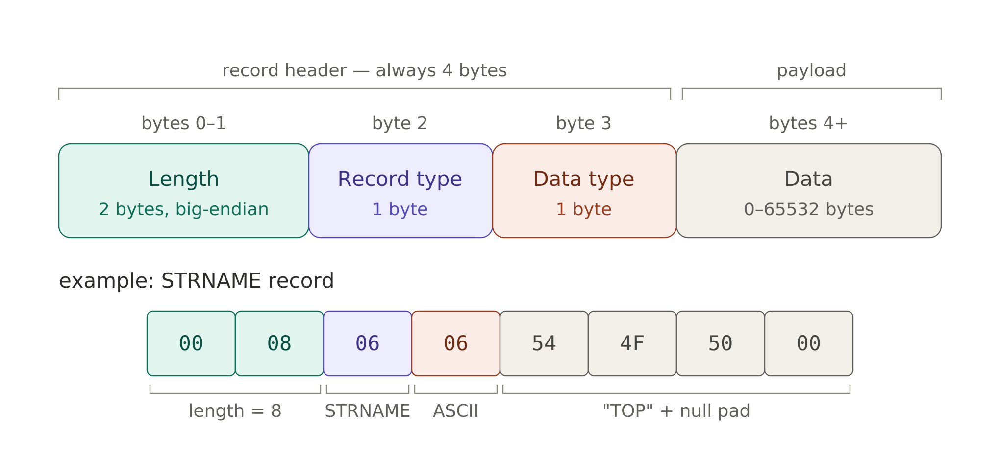
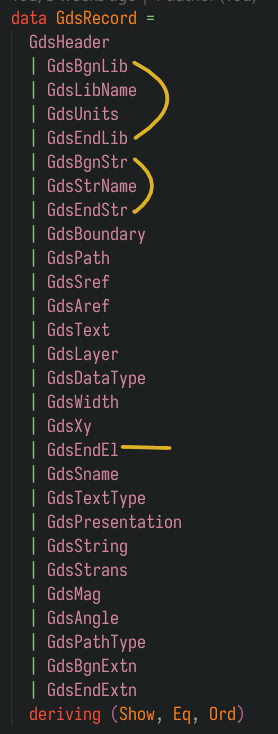
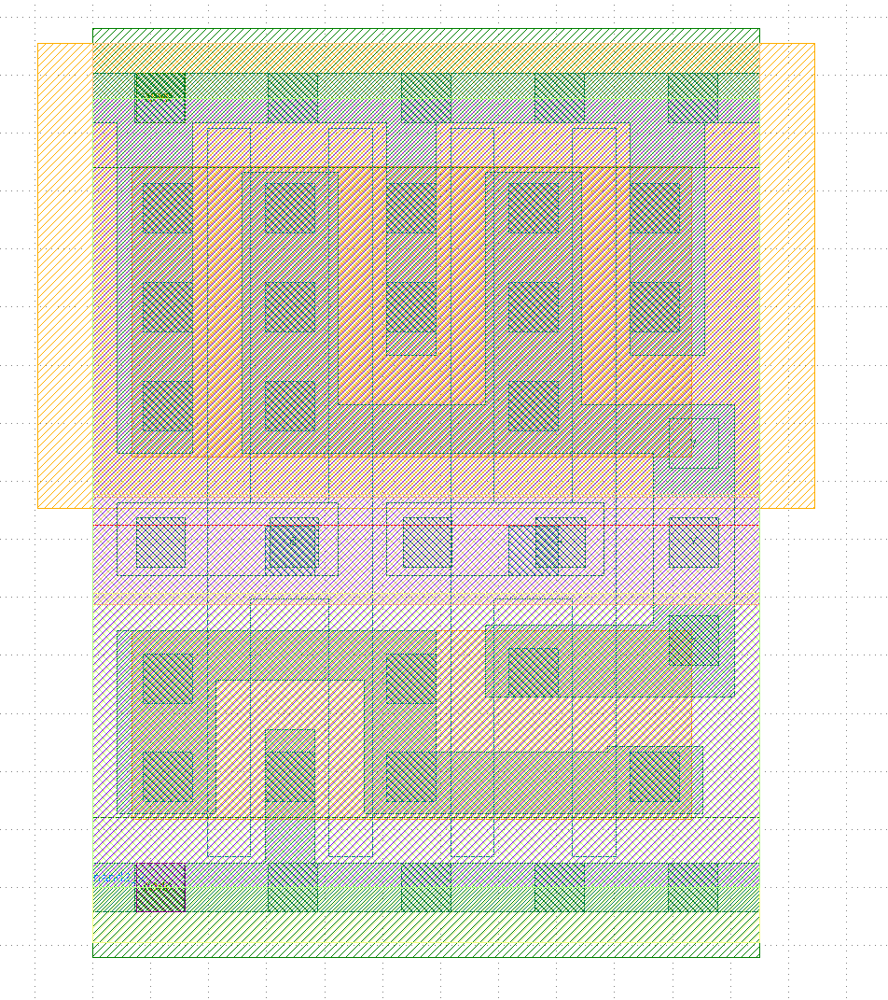
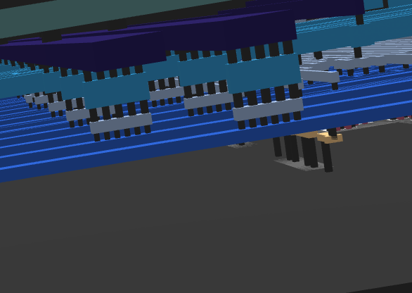
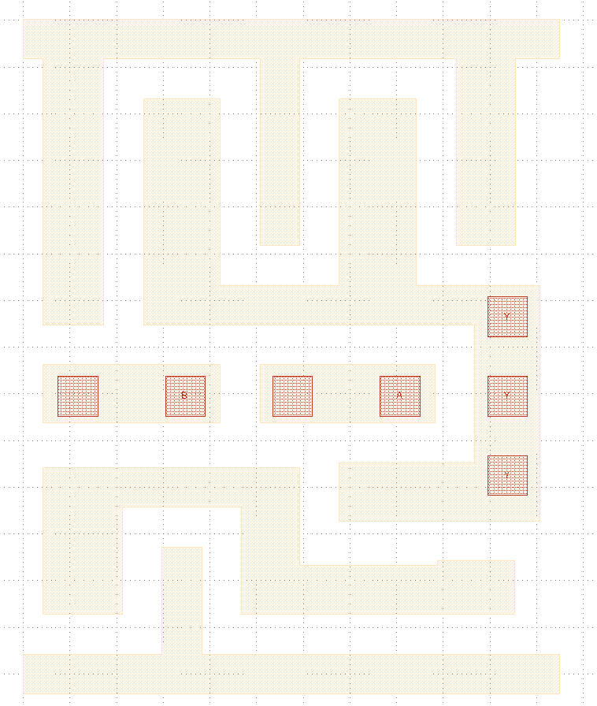

# Gandalf

## tl;dr

<p align="center">
  
</p>

## The Mines of Moria

All the secrets lay in the [GDS puzzle file](inputs/puzzle.gds). There's two halves to the
puzzle: first find out what sequence of the input `I` causes `success` to be set and secondly what
that causes `O[8]` to emit. Given that it is a 8-bit output, I am expecting a series of characters.
The [example input](inputs/example_inputs.vcd) contain 121 bit long input sequences. This may be of
help later, but first to reverse-engineer the circuit. Lets enter the Mines!

### The Red Book of Westmarch *aka GDS file*

At it's core, a GDS file is a long sequence of records. Each record is of the following format:

<p align="center">
    
</p>

[Parse.hs](src/Parse.hs) contains the records and parsing code for performing this. I use attoparsec
for as my parser combinator library. The records only tell one-half of the story though. In reality,
it is a flattened representation of the actual structure. If we look at the record types, we get an
idea of the actual nesting structure:

<p align="left">
    
</p>

So as it turns out, EndEl is an end statement, which ends several other elements. This helps us to
build a sort of AST, to capture the forest of trees structure of a GDS file. This is coded in
[AST.hs](src/AST.hs). It uses a simple stack based method to create a level of nesting when a 
*begin element* is found and pops off the level when an *end element* is found. The following fragment
identifies these:

```haskell
isOpener :: GdsRecordT -> Bool
isOpener r = case r of
  GdsBgnLibT{} -> True
  GdsBgnStrT{} -> True
  GdsBoundaryT -> True
  GdsPathT     -> True
  GdsSrefT     -> True
  GdsArefT     -> True
  GdsTextT     -> True
  _            -> False

isCloser :: GdsRecordT -> Bool
isCloser r = case r of
  GdsEndLibT -> True
  GdsEndStrT -> True
  GdsEndElT  -> True
  _          -> False

```

In keeping with common terminology, a `BgnStr` and `EndStr` defines a **Cell**. Thus, a GDS file can
be considered to be a set of cells, among which there is a *top cell*. The record definition of a Cell
is as follows, defined in [Structure.hs](src/Structure.hs):

```haskell
data Cell = Cell
  { name     :: String
  , boundary :: [Boundary]
  , path     :: [Path]
  , text     :: [TextDescription]
  , cellRef  :: [CellRef]
  } deriving (Show)
```

A cell contain's **paths** and **boundaries**. Both are effectively traces in some layer of the IC.
The only distinction is in the
fact that a boundary defines an ortholinear polygon. A path is a straight connection, with end caps
that can either stick out, or be round or be flat. The file that we are given has no round ends tho,
so this makes life a bit easier later.

The text's act as labels, and are handily in the same layer as the thing they are describing. Layer's
in GDS have an `index` and a `kind`. The `index` indentifies the actual layer, while the `kind` is
used to differentiate between different elements in a layer. For instance, the boundary and text
are present in different `kind`'s.

The true "nesting" nature of the GDS file lies in the `cellRef` element. As the name suggests, it is
a reference to a cell that is already declared.
```haskell
data CellRef = CellRef
  { name        :: String
  , coord       :: Coordinate
  , translation :: Maybe GdsStransFlags
  , angle       :: Maybe Double
  } deriving (Show)
```
The reference is by name. A `CellRef` thus can be considered as an instantiation of a cell. The
instantiation (as performed by the PNR tool) positions it at some coordinate, at some angle (this is usually 0 or 90),
and with a "translation" (this is to perform something like mirroring).

We can dump the structure of the GDS file using the `dump` command defined in [Main.hs](exe/Main.hs).
For non-top cells, we get definitions such as follows:

<details>
<summary>Click to expand</summary>

```
└── Cell "sky130_fd_sc_hd__nand2_2"
    ├── Boundary
    │   ├── layer: Layer {index = 67, kind = 20}
    │   └── coords: [(0, -85), (0, 85), (595, 85), (595, 545), (765, 545), (765, 85), (2300, 85), (2300, -85), (0, -85)]
    ├── Boundary
    │   ├── layer: Layer {index = 67, kind = 20}
    │   └── coords: [(85, 1495), (85, 2635), (0, 2635), (0, 2805), (2300, 2805), (2300, 2635), (2110, 2635), (2110, 1835), (1855, 1835), (1855, 2635), (1185, 2635), (1185, 1835), (1015, 1835), (1015, 2635), (345, 2635), (345, 1495), (85, 1495)]
    ├── Boundary
    │   ├── layer: Layer {index = 67, kind = 20}
    │   └── coords: [(85, 255), (85, 885), (1185, 885), (1185, 465), (1775, 465), (1775, 485), (2105, 485), (2105, 255), (935, 255), (935, 715), (425, 715), (425, 255), (85, 255)]
    ├── Boundary
    │   ├── layer: Layer {index = 67, kind = 20}
    │   └── coords: [(1355, 655), (1355, 905), (1935, 905), (1935, 1495), (515, 1495), (515, 2465), (845, 2465), (845, 1665), (1355, 1665), (1355, 2465), (1685, 2465), (1685, 1665), (2215, 1665), (2215, 655), (1355, 655)]
    ├── Boundary
    │   ├── layer: Layer {index = 67, kind = 20}
    │   └── coords: [(85, 1075), (85, 1325), (845, 1325), (845, 1075), (85, 1075)]
    ├── Boundary
    │   ├── layer: Layer {index = 67, kind = 20}
    │   └── coords: [(1015, 1075), (1015, 1325), (1765, 1325), (1765, 1075), (1015, 1075)]
    ├── Boundary
    │   ├── layer: Layer {index = 67, kind = 44}
    │   └── coords: [(145, 2635), (145, 2805), (315, 2805), (315, 2635), (145, 2635)]
    ├── Boundary
    │   ├── layer: Layer {index = 67, kind = 44}
    │   └── coords: [(145, -85), (145, 85), (315, 85), (315, -85), (145, -85)]
    ├── Boundary
    │   ├── layer: Layer {index = 67, kind = 44}
    │   └── coords: [(605, 2635), (605, 2805), (775, 2805), (775, 2635), (605, 2635)]
    ├── Boundary
    │   ├── layer: Layer {index = 67, kind = 44}
    │   └── coords: [(605, -85), (605, 85), (775, 85), (775, -85), (605, -85)]
    ├── Boundary
    │   ├── layer: Layer {index = 67, kind = 44}
    │   └── coords: [(1065, 2635), (1065, 2805), (1235, 2805), (1235, 2635), (1065, 2635)]
    ├── Boundary
    │   ├── layer: Layer {index = 67, kind = 44}
    │   └── coords: [(1065, -85), (1065, 85), (1235, 85), (1235, -85), (1065, -85)]
    ├── Boundary
    │   ├── layer: Layer {index = 67, kind = 44}
    │   └── coords: [(1525, 2635), (1525, 2805), (1695, 2805), (1695, 2635), (1525, 2635)]
    ├── Boundary
    │   ├── layer: Layer {index = 67, kind = 44}
    │   └── coords: [(1525, -85), (1525, 85), (1695, 85), (1695, -85), (1525, -85)]
    ├── Boundary
    │   ├── layer: Layer {index = 67, kind = 44}
    │   └── coords: [(1985, 2635), (1985, 2805), (2155, 2805), (2155, 2635), (1985, 2635)]
    ├── Boundary
    │   ├── layer: Layer {index = 67, kind = 44}
    │   └── coords: [(1985, -85), (1985, 85), (2155, 85), (2155, -85), (1985, -85)]
    ├── Boundary
    │   ├── layer: Layer {index = 67, kind = 16}
    │   └── coords: [(1990, 765), (1990, 935), (2160, 935), (2160, 765), (1990, 765)]
    ├── Boundary
    │   ├── layer: Layer {index = 67, kind = 16}
    │   └── coords: [(1990, 1105), (1990, 1275), (2160, 1275), (2160, 1105), (1990, 1105)]
    ├── Boundary
    │   ├── layer: Layer {index = 67, kind = 16}
    │   └── coords: [(1990, 1445), (1990, 1615), (2160, 1615), (2160, 1445), (1990, 1445)]
    ├── Boundary
    │   ├── layer: Layer {index = 67, kind = 16}
    │   └── coords: [(1530, 1105), (1530, 1275), (1700, 1275), (1700, 1105), (1530, 1105)]
    ├── Boundary
    │   ├── layer: Layer {index = 67, kind = 16}
    │   └── coords: [(1070, 1105), (1070, 1275), (1240, 1275), (1240, 1105), (1070, 1105)]
    ├── Boundary
    │   ├── layer: Layer {index = 67, kind = 16}
    │   └── coords: [(610, 1105), (610, 1275), (780, 1275), (780, 1105), (610, 1105)]
    ├── Boundary
    │   ├── layer: Layer {index = 67, kind = 16}
    │   └── coords: [(150, 1105), (150, 1275), (320, 1275), (320, 1105), (150, 1105)]
    ├── Boundary
    │   ├── layer: Layer {index = 68, kind = 16}
    │   └── coords: [(150, -85), (150, 85), (320, 85), (320, -85), (150, -85)]
    ├── Boundary
    │   ├── layer: Layer {index = 68, kind = 16}
    │   └── coords: [(150, 2635), (150, 2805), (320, 2805), (320, 2635), (150, 2635)]
    ├── Boundary
    │   ├── layer: Layer {index = 64, kind = 16}
    │   └── coords: [(150, 2635), (150, 2805), (320, 2805), (320, 2635), (150, 2635)]
    ├── Boundary
    │   ├── layer: Layer {index = 122, kind = 16}
    │   └── coords: [(150, -85), (150, 85), (320, 85), (320, -85), (150, -85)]
    ├── Boundary
    │   ├── layer: Layer {index = 236, kind = 0}
    │   └── coords: [(0, 0), (0, 2720), (2300, 2720), (2300, 0), (0, 0)]
    ├── Boundary
    │   ├── layer: Layer {index = 66, kind = 20}
    │   └── coords: [(1235, 105), (1235, 2615), (1385, 2615), (1385, 1325), (1655, 1325), (1655, 2615), (1805, 2615), (1805, 105), (1655, 105), (1655, 995), (1385, 995), (1385, 105), (1235, 105)]
    ├── Boundary
    │   ├── layer: Layer {index = 66, kind = 20}
    │   └── coords: [(395, 105), (395, 2615), (545, 2615), (545, 1325), (815, 1325), (815, 2615), (965, 2615), (965, 105), (815, 105), (815, 995), (545, 995), (545, 105), (395, 105)]
    ├── Boundary
    │   ├── layer: Layer {index = 81, kind = 4}
    │   └── coords: [(0, 0), (0, 2720), (2300, 2720), (2300, 0), (0, 0)]
    ├── Boundary
    │   ├── layer: Layer {index = 94, kind = 20}
    │   └── coords: [(0, 1355), (0, 2910), (2300, 2910), (2300, 1355), (0, 1355)]
    ├── Boundary
    │   ├── layer: Layer {index = 93, kind = 44}
    │   └── coords: [(0, -190), (0, 1015), (2300, 1015), (2300, -190), (0, -190)]
    ├── Boundary
    │   ├── layer: Layer {index = 65, kind = 20}
    │   └── coords: [(135, 1485), (135, 2485), (2065, 2485), (2065, 1485), (135, 1485)]
    ├── Boundary
    │   ├── layer: Layer {index = 65, kind = 20}
    │   └── coords: [(135, 235), (135, 885), (2065, 885), (2065, 235), (135, 235)]
    ├── Boundary
    │   ├── layer: Layer {index = 64, kind = 20}
    │   └── coords: [(-190, 1305), (-190, 2910), (2490, 2910), (2490, 1305), (-190, 1305)]
    ├── Boundary
    │   ├── layer: Layer {index = 78, kind = 44}
    │   └── coords: [(0, 1250), (0, 2720), (2300, 2720), (2300, 1250), (0, 1250)]
    ├── Boundary
    │   ├── layer: Layer {index = 95, kind = 20}
    │   └── coords: [(0, 975), (0, 1345), (2300, 1345), (2300, 975), (0, 975)]
    ├── Boundary
    │   ├── layer: Layer {index = 66, kind = 44}
    │   └── coords: [(175, 2255), (175, 2425), (345, 2425), (345, 2255), (175, 2255)]
    ├── Boundary
    │   ├── layer: Layer {index = 66, kind = 44}
    │   └── coords: [(175, 1915), (175, 2085), (345, 2085), (345, 1915), (175, 1915)]
    ├── Boundary
    │   ├── layer: Layer {index = 66, kind = 44}
    │   └── coords: [(175, 1575), (175, 1745), (345, 1745), (345, 1575), (175, 1575)]
    ├── Boundary
    │   ├── layer: Layer {index = 66, kind = 44}
    │   └── coords: [(175, 635), (175, 805), (345, 805), (345, 635), (175, 635)]
    ├── Boundary
    │   ├── layer: Layer {index = 66, kind = 44}
    │   └── coords: [(175, 295), (175, 465), (345, 465), (345, 295), (175, 295)]
    ├── Boundary
    │   ├── layer: Layer {index = 66, kind = 44}
    │   └── coords: [(1855, 295), (1855, 465), (2025, 465), (2025, 295), (1855, 295)]
    ├── Boundary
    │   ├── layer: Layer {index = 66, kind = 44}
    │   └── coords: [(595, 2255), (595, 2425), (765, 2425), (765, 2255), (595, 2255)]
    ├── Boundary
    │   ├── layer: Layer {index = 66, kind = 44}
    │   └── coords: [(595, 1915), (595, 2085), (765, 2085), (765, 1915), (595, 1915)]
    ├── Boundary
    │   ├── layer: Layer {index = 66, kind = 44}
    │   └── coords: [(595, 1575), (595, 1745), (765, 1745), (765, 1575), (595, 1575)]
    ├── Boundary
    │   ├── layer: Layer {index = 66, kind = 44}
    │   └── coords: [(595, 1075), (595, 1245), (765, 1245), (765, 1075), (595, 1075)]
    ├── Boundary
    │   ├── layer: Layer {index = 66, kind = 44}
    │   └── coords: [(595, 295), (595, 465), (765, 465), (765, 295), (595, 295)]
    ├── Boundary
    │   ├── layer: Layer {index = 66, kind = 44}
    │   └── coords: [(1015, 2255), (1015, 2425), (1185, 2425), (1185, 2255), (1015, 2255)]
    ├── Boundary
    │   ├── layer: Layer {index = 66, kind = 44}
    │   └── coords: [(1015, 1915), (1015, 2085), (1185, 2085), (1185, 1915), (1015, 1915)]
    ├── Boundary
    │   ├── layer: Layer {index = 66, kind = 44}
    │   └── coords: [(1015, 635), (1015, 805), (1185, 805), (1185, 635), (1015, 635)]
    ├── Boundary
    │   ├── layer: Layer {index = 66, kind = 44}
    │   └── coords: [(1015, 295), (1015, 465), (1185, 465), (1185, 295), (1015, 295)]
    ├── Boundary
    │   ├── layer: Layer {index = 66, kind = 44}
    │   └── coords: [(1435, 2255), (1435, 2425), (1605, 2425), (1605, 2255), (1435, 2255)]
    ├── Boundary
    │   ├── layer: Layer {index = 66, kind = 44}
    │   └── coords: [(1435, 1915), (1435, 2085), (1605, 2085), (1605, 1915), (1435, 1915)]
    ├── Boundary
    │   ├── layer: Layer {index = 66, kind = 44}
    │   └── coords: [(1435, 1575), (1435, 1745), (1605, 1745), (1605, 1575), (1435, 1575)]
    ├── Boundary
    │   ├── layer: Layer {index = 66, kind = 44}
    │   └── coords: [(1435, 1075), (1435, 1245), (1605, 1245), (1605, 1075), (1435, 1075)]
    ├── Boundary
    │   ├── layer: Layer {index = 66, kind = 44}
    │   └── coords: [(1435, 655), (1435, 825), (1605, 825), (1605, 655), (1435, 655)]
    ├── Boundary
    │   ├── layer: Layer {index = 66, kind = 44}
    │   └── coords: [(1855, 2255), (1855, 2425), (2025, 2425), (2025, 2255), (1855, 2255)]
    ├── Boundary
    │   ├── layer: Layer {index = 66, kind = 44}
    │   └── coords: [(1855, 1915), (1855, 2085), (2025, 2085), (2025, 1915), (1855, 1915)]
    ├── Path
    │   ├── layer: Layer {index = 68, kind = 20}
    │   ├── width: 480
    │   ├── start: (0, 2720)
    │   ├── end: (2300, 2720)
    │   └── kind: Flush
    ├── Path
    │   ├── layer: Layer {index = 68, kind = 20}
    │   ├── width: 480
    │   ├── start: (0, 0)
    │   ├── end: (2300, 0)
    │   └── kind: Flush
    ├── Text
    │   ├── layer: Layer {index = 67, kind = 5}
    │   ├── coord: (2075, 850)
    │   ├── value: "Y"
    │   ├── translation: {mirrorX=False, absMag=False, absAngle=False}
    │   ├── presentation: {font=0, vertJust=1, horizJust=1}
    │   └── magnification: 0.125
    ├── Text
    │   ├── layer: Layer {index = 67, kind = 5}
    │   ├── coord: (2075, 1190)
    │   ├── value: "Y"
    │   ├── translation: {mirrorX=False, absMag=False, absAngle=False}
    │   ├── presentation: {font=0, vertJust=1, horizJust=1}
    │   └── magnification: 0.125
    ├── Text
    │   ├── layer: Layer {index = 67, kind = 5}
    │   ├── coord: (2075, 1530)
    │   ├── value: "Y"
    │   ├── translation: {mirrorX=False, absMag=False, absAngle=False}
    │   ├── presentation: {font=0, vertJust=1, horizJust=1}
    │   └── magnification: 0.125
    ├── Text
    │   ├── layer: Layer {index = 67, kind = 5}
    │   ├── coord: (1615, 1190)
    │   ├── value: "A"
    │   ├── translation: {mirrorX=False, absMag=False, absAngle=False}
    │   ├── presentation: {font=0, vertJust=1, horizJust=1}
    │   └── magnification: 0.125
    ├── Text
    │   ├── layer: Layer {index = 67, kind = 5}
    │   ├── coord: (695, 1190)
    │   ├── value: "B"
    │   ├── translation: {mirrorX=False, absMag=False, absAngle=False}
    │   ├── presentation: {font=0, vertJust=1, horizJust=1}
    │   └── magnification: 0.125
    ├── Text
    │   ├── layer: Layer {index = 68, kind = 5}
    │   ├── coord: (230, 0)
    │   ├── value: "VGND"
    │   ├── translation: {mirrorX=False, absMag=False, absAngle=False}
    │   ├── presentation: {font=0, vertJust=1, horizJust=1}
    │   └── magnification: 0.1
    ├── Text
    │   ├── layer: Layer {index = 68, kind = 5}
    │   ├── coord: (230, 2720)
    │   ├── value: "VPWR"
    │   ├── translation: {mirrorX=False, absMag=False, absAngle=False}
    │   ├── presentation: {font=0, vertJust=1, horizJust=1}
    │   └── magnification: 0.1
    ├── Text
    │   ├── layer: Layer {index = 64, kind = 5}
    │   ├── coord: (230, 2720)
    │   ├── value: "VPB"
    │   ├── translation: {mirrorX=False, absMag=False, absAngle=False}
    │   ├── presentation: {font=0, vertJust=1, horizJust=1}
    │   └── magnification: 0.1
    ├── Text
    │   ├── layer: Layer {index = 64, kind = 59}
    │   ├── coord: (230, 0)
    │   ├── value: "VNB"
    │   ├── translation: {mirrorX=False, absMag=False, absAngle=False}
    │   ├── presentation: {font=0, vertJust=1, horizJust=1}
    │   └── magnification: 0.1
    └── Text
        ├── layer: Layer {index = 83, kind = 44}
        ├── coord: (0, 0)
        ├── value: "nand2_2"
        ├── translation: {mirrorX=False, absMag=False, absAngle=False}
        ├── angle: 90.0
        └── magnification: 0.1

```

</details>

The rather wordy definition can be represented by a neat diagram in a GDS file viewer called
KLayout:

<p align="center">
    
</p>

Okay fine, I lied. There's nothing neat about this diagram and is probably less understandable
than the text version. What's all those ugly colours and why's there so many rectangles?

### There's Layers to this

Remember, when I said that all the elements in a Cell have a "layer"? That's all the colours.
Turns out that, even though in a GDS file you can have sensibly named cells such as `sky130_fd_sc_hd__nand2_2`
(so a NAND gate with 2 inputs), these cells look nothing like the diagrams we draw in netlists. An
IC has multiple layers. The lowest layer will be the die itself. Within it, photolithographic techniques
(yes ASML) are used to create "diffusion" areas to make transistors (some variant of FET's for most parts).
Yet more layers are deposited over them to create metal layers to create connections. Other materials
can be deposited to make things like capacitors and resistors.

Crucially, there isn't just one metallic layer and various layers need to be interconnected. A layer
can be considered a horizontal plane in a vertically stacked die. Inter-layer connections are created
using **VIA**'s. These are effectively little cuts made in the two layers being connected and an
electrical connection created in the cut part. Those are all the little squares you see in the NAND
diagram above. Opening the GDS file in TinyTapeout's GDS viewer lets us see the GDS file in 3D. The
little black columns in the image below shows the VIA's.

<p align="center">
    
</p>

There's one information gap we need to solve before we can proceeed. What layers are metallic and
what layer's aren't. Also, which layers have the VIA's and which pair of layers do they connect.
Such information is found in LYP files (layer property files), which are provided by the creator of
the cells being used by the PNR tool.

So who created these cells? The hint is in the name of the cells themselves:

```
├── Cell "sky130_fd_sc_hd__decap_3"
├── Cell "sky130_fd_sc_hd__tapvpwrvgnd_1"
├── Cell "sky130_fd_sc_hd__nand2_2"
├── Cell "sky130_fd_sc_hd__and2_2"
├── Cell "sky130_fd_sc_hd__xor2_2"
├── Cell "sky130_fd_sc_hd__xnor2_2"
├── Cell "sky130_fd_sc_hd__a31o_2"
├── Cell "sky130_fd_sc_hd__or2_2"
├── Cell "sky130_fd_sc_hd__nor2_2"
├── Cell "sky130_fd_sc_hd__a21bo_2"
├── Cell "sky130_fd_sc_hd__a21o_2"
├── Cell "sky130_fd_sc_hd__a21boi_2"
├── Cell "sky130_fd_sc_hd__o21bai_2"
├── Cell "sky130_fd_sc_hd__clkbuf_16"
├── Cell "sky130_fd_sc_hd__and3_2"
├── Cell "sky130_fd_sc_hd__and4bb_2"
├── Cell "sky130_fd_sc_hd__mux2_1"
├── Cell "sky130_fd_sc_hd__dfrtp_2"
├── Cell "VIA_via5_6_2000_2000_1_1_1600_1600"
├── Cell "VIA_via4_5_2000_480_1_5_400_400"
├── Cell "VIA_via3_4_2000_480_1_5_400_400"
├── Cell "VIA_via2_3_2000_480_1_6_320_320"
├── Cell "VIA_M2M3_PR"
├── Cell "VIA_M1M2_PR"
├── Cell "VIA_L1M1_PR_MR"
├── Cell "VIA_M3M4_PR"
└── Cell "adder_demo"
```

Looking up "sky130 cells" leads us straight to the [Skywater PDK](https://github.com/google/skywater-pdk) repo.
Turns out this is an open-source PDK (process-design kit). Annoyingly though, this repo doesn't contain
the LYP file. Searching around led me to the [Skywater 130nm Technology PDK for KLayout](https://github.com/efabless/sky130_klayout_pdk) repo. They have [LYP file](layers/sky130.lyp) we need. Additionlly, they also have a [LYT file](layers/sky130.lyt), which contains the actual connection information. A small [python script](layers/extract_layers.py) dumps
the layers and the connection info as a [json file](layers/sky130_layers.json). This can be read into
the parser via [Layer.hs](src/LayerMap.hs).

Loading up the LYP file in KLayout, shows us something interesting. For each layer, there are several
kinds that seem to be standardised:

- `.drawing`: The main boundaries and paths
- `.label`: Text label
- `.pin`: Smalll squares to mark the terminals

In particular, the labels actually reside bang inside the pin's. The diagram below shows the structure
of the `li` layer of the NAND cell from before:

<p align="center">
    
</p>

Thus, we can identify the pin's in each layer. The `pin` command dumps just this information, in a
format such as in [puzzle.pins](pins/puzzle.pins). For the standard cells, obtaining the pinout like
this is a bit redundant, since we can easily pull that from the descriptive verilog that the Skywater PDK
repo contains. Nevertheless, this way we can also associate the layers containing the pins, which will
be helpful later. Using Claude, I convert the ad-hoc description into a [puzzle.yaml](pins/puzzle.yaml)
format, where helpful descriptions have been added based of the provided behavioural verilog files in the
PDK repo. The haskell side parser resides in [Component.hs](src/Component.hs), thus giving the parser
a list of the "parts", their pins and which layer to look for them in.